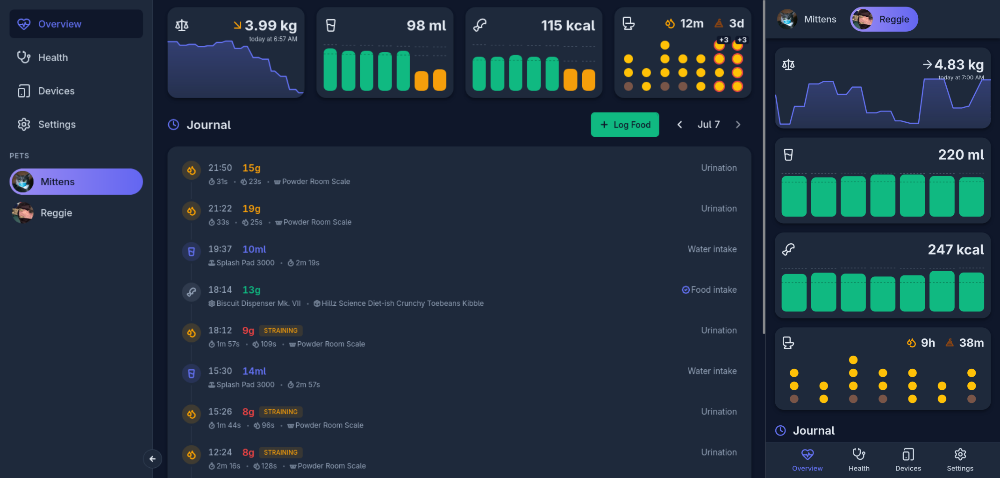

# Pet Assistant

_Self-hosted pet health monitoring. One dashboard for all your devices._



---

Pet Assistant is a self-hosted app that connects your smart pet devices into one place and turns their data into something useful. Feeders, litterboxes, fountains, cameras — instead of checking five different vendor apps, you get a single dashboard that tracks health trends across all your cats.

The long-term goal is to support every major smart pet brand (PetKit, PetLibro, Xiaomi, SurePet, and more) and give you a unified health record — vet visits, medications, weight trends, elimination patterns, feeding history — without sending your data to anyone's cloud.

Right now, it does device telemetry and daily health monitoring well. Clinical records, care plans, and a household-wide alerting system are coming next.

### A note on expectations

This is a personal project I've been building and using daily for over a year. It works great for me — it's caught real health issues early and I genuinely rely on it. But it's also largely vibe-coded, shaped by my specific setup, and has rough edges I haven't gotten around to sanding down. I'm sharing it because I wish something like this existed when I started, not because it's polished software ready for a wide audience. If you're comfortable self-hosting something scrappy, you'll probably get value out of it. If you expect a plug-and-play product, this isn't there yet.

## What it does today

**Daily dashboard** — one view per cat, per day. Weight, water intake, food consumed, litterbox visits, and a timeline of everything that happened.

**Litterbox analytics** — visit frequency, time between eliminations, duration, output weight, straining detection. A 7-day grid shows patterns at a glance; drill into any day for the full picture.

**Multi-device, multi-cat** — connect as many devices as you have. The app tracks which cat used which device (manually or via AI pet recognition) and keeps everything organized per pet.

**Activity journal** — a chronological feed of everything: litterbox visits, meals, water, device events, maintenance logs. Tap any entry for details.

## What's coming

**Home signals** — a household-wide view that tells you what needs attention: who hasn't eaten, whose urination frequency spiked, which device battery is dying.

**Health records** — vet visits, lab results, imaging, vaccinations. Upload PDFs, track medication adherence, keep everything in one place per cat.

**Care plans and reminders** — medication schedules, vaccination due dates, device maintenance intervals, custom reminders. Mark things done from the dashboard.

**More integrations** — PetKit, PetLibro, Xiaomi, and other smart pet brands. The provider system is designed to be extensible without touching core code.

**Home Assistant via MQTT** — expose your pets and devices to HA as standard MQTT entities, so you get one integration instead of N+1 vendor-specific ones loading in your HA instance.

## Supported hardware

| Integration                                                                                             | Devices                                    | Connection                       |
| ------------------------------------------------------------------------------------------------------- | ------------------------------------------ | -------------------------------- |
| [ESPHome Litterbox Monitor](https://github.com/cristianchelu/esphome-litterbox-monitor)                 | Smart litterbox (ESP32 + load cells)       | Direct via mDNS on your LAN      |
| [ESPHome Pet Bowl Monitor](https://github.com/cristianchelu/oddware/tree/main/esphome.pet-bowl-monitor) | Water bowl monitor (ESP32-CAM + load cell) | Direct via mDNS on your LAN      |
| **SurePet**                                                                                             | SureFeed Connect feeders                   | Cloud API (unofficial)           |
| **Cameras**                                                                                             | Any HTTP snapshot camera                   | URL polling                      |
| **Thingino**                                                                                            | Thingino-flashed cameras                   | HTTP WebUI (API key)             |
| **AI recognizer**                                                                                       | Pet identification                         | Any OpenAI-compatible vision API |

The ESPHome devices are DIY builds — check their repos for hardware details and flashing instructions. More device firmware will be published as it's ready.

The provider architecture is designed so adding a new brand means writing one adapter — no changes to the UI, database, or API routes. See [docs/integrations.md](docs/integrations.md) for details and disclaimers about unofficial APIs.

## Quick start

### With npm (development)

```bash
git clone https://github.com/cristianchelu/cat-health.git
cd cat-health
npm install
npm run migrate
npm run dev
```

The API starts on `:3000` and Vite serves the UI with hot reload. Open `http://localhost:5173`.

### With Docker (production)

```bash
docker compose up -d --build
```

The app runs on port `3000` — API and UI served together. Data persists in mounted volumes. Works fine on a Raspberry Pi.

Copy `packages/api/.env.example` to `packages/api/.env` if you need to configure CORS origins or file paths. See [CONTRIBUTING.md](CONTRIBUTING.md) for the full development setup.

## Security

Pet Assistant has **no authentication**. Anyone on your network can read and write all data, including integration credentials stored in SQLite. This is by design — it's a homelab tool, not a public service.

Run it behind your firewall, on a trusted LAN or VPN. Don't port-forward it to the internet. See [SECURITY.md](SECURITY.md) for the full picture.

## Contributing

Pull requests are welcome. The codebase is a monorepo with three packages:

| Package           | What it is                                |
| ----------------- | ----------------------------------------- |
| `packages/api`    | Fastify backend, SQLite, device providers |
| `packages/ui`     | React frontend (Vite, TanStack Query)     |
| `packages/shared` | Shared TypeBox schemas and types          |

See [CONTRIBUTING.md](CONTRIBUTING.md) for setup, conventions, and commit format.

## License

[AGPL-3.0](LICENSE) — use it, modify it, self-host it. If you run a modified version as a network service, share your source.
